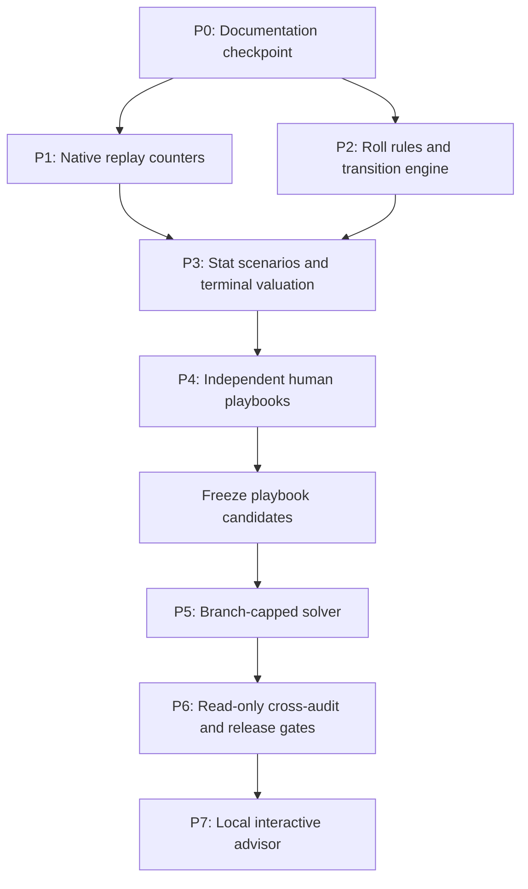

# TI 2026 Group 40-Roll playbook v1 implementation

Status: P0–P7 implemented and independently recorded; v1 closed with both manuals still `draft`

Decision scope closed: 2026-08-06

P0 code baseline: `b347ff2` (`54 passed` in `12.81s` on 2026-08-06)

Implementation closure: P0–P6 were committed phase-by-phase; P7 implementation commit is
`f7640d7`. The final P7 run is `fantasy-125d96172389a0aa`, with semantic evidence hash
`07c14dffe8f2b9c216aa30f3d6ff7ec4cd81106087f95d59fddcd8779dd7051c`. The frozen plan remains
the decision record; measured deviations and honest failure labels are in the dated phase reports.

| Phase | Implementation commits | Closed result |
| --- | --- | --- |
| P0 | `1b9804` | Scope, terminology, source priority and route separation frozen |
| P1 | `87fde6` | Five native replay counters and provenance-safe backfill path |
| P2 | `257746` | Immutable Group transition support and model-conditional probabilities |
| P3 | `362ddb`, `3dcab47` | Common Series scenarios, terminal valuation and clean evidence |
| P4 | `6fd0b61`, `b605803` | Two independently frozen manuals; both honestly labelled `draft` |
| P5 | `a7b8755`, `eab526a`, `64030a8` | Branch-capped solver implemented; effectiveness gate failed |
| P6 | `db9c3a1`, `58036bd`, `b911d9d` | Read-only audit completed partially; no manual rewritten |
| P7 | `b5c76d2`, `f7640d7` | Local advisor contract and implementation; functional/performance gates passed |

The full offline suite at P7 is `128 passed, 1 skipped`. Phase artifacts remain ignored local run
outputs; their semantic/file hashes and run IDs are committed in the dated reports.

## Objective

Produce two concise, independently derived Markdown playbooks for the 40 Group Roll tokens, backed
by exact 2026 Fantasy evidence and standalone validation. Implement a bounded Reference Roll solver
as a separate auditor and a secondary local Interactive Roll advisor. Reserve interfaces for Main
without implementing Main policy behavior.

The primary release product is the Human Roll playbook evidence package, not the solver or UI.

## Grilling closure

The product and decision-design grilling is complete enough to start implementation. The following
were explicitly resolved during the interview and are not implementation-time choices:

| Aspect | Accepted decision |
| --- | --- |
| Period | Group only; exactly 40 Roll tokens. Main is an interface extension only. |
| Strategy shape | Emblem-first; choose the best matching team for each role after evaluating the resulting War Banner. |
| Team coherence | All slots of one role's War Banner use the same selected team; Core and Support retain their real two-player pairing. |
| State | The currently visible three War Banners and three shared options are conditioned-on facts, not randomly generated starting inputs. |
| Uncertainty | Future Roll outcomes and future Group match performance both belong in the policy outcome distribution. |
| Objective | Retain policies within `epsilon` of maximum Expected Group score, then maximize lower-tail CVaR10. Report `epsilon = 0%, 1%, 2%, 5%`; select the default from the measured frontier knee. |
| Unknown rates | Never claim true backend rates. Publish a Rate-agnostic playbook and a separate Primary-model best-guess playbook. Do not learn rates during one 40-Roll session. |
| Stat evidence | Estimate contribution from governed historical Games with Series-aware resampling; do not optimize a perfect or best-case Roll outcome. |
| Stat grades | Use four Baseline Stat grades and a separate bootstrap stability/boundary marker; a visible top three is descriptive, not an automatic lock rule. |
| Exact special stats | Madstone, Smoke, Watcher, Lotus and Tormentor use native replay counters. OpenDota event maps remain diagnostic proxies and never fill exact `null`. |
| Quality and Trait | Value the complete positioned configuration. Benevolent, Vampiric, Friendly, Unique and Fractal have no context-free tier order. |
| Manual priority | The human-readable playbooks are the primary product and are derived before solver results are inspected. |
| Manual editions | Produce one Rate-agnostic Markdown playbook and one Primary-model Markdown playbook; the latter is the normal default when applicable. |
| Manual complexity | At most two quick-reference sheets, twelve ordered rules, three visible conditions per rule and three rounded Roll phases; compare 8/12/16-rule candidates. |
| Manual reliability | Initial material-loss limit is 10% with one-sided 95% evidence; additionally report whether the stricter 5% tier passes. Common means at least 10% of sessions in any declared validation stratum/model. |
| Route separation | Playbook and solver are separately versioned. Solver cross-audit is read-only and cannot silently generate or patch manual rules. |
| Preferred solver | Implement the Branch-capped Roll solver first with fixed synergy-potential continuation; retain the Full configuration planner only as a dormant explicit fallback. |
| Solver claim | Approximate bounded evaluator, never a proof of the global 40-Roll optimum. Unresolved comparisons remain unresolved. |
| UI | Secondary, local-only, manually confirmed state tracking; no Steam/Dota control and no unconfirmed OCR action. |
| Runtime | Target three hours for one cached-snapshot analysis, absolute ceiling five hours; stop new computation at 4h45 and reserve 15 minutes for reporting. |

No further user choice blocks implementation. Empirical questions are listed later as gates rather
than interview questions.

## P0 baseline and capabilities missing at that checkpoint

Already present:

- immutable OpenDota captures, explicit UTC `as_of`, stable player IDs and roster intervals;
- 2026 Fantasy player-history scope and `fantasy_performance_samples.parquet`;
- base Fantasy scoring, Quality and Trait arithmetic, Series aggregation helpers and a static
  Fantasy recommender;
- local Streamlit app, run manifests, audit status and deterministic tests;
- accepted solver and replay-source decisions in ADR-0003 and ADR-0004.

Not present:

- production replay download/parser path for the five native counters;
- version/presence-aware exact-stat backfill and a Watcher support boundary;
- machine-readable Roll operations and a pure transition engine;
- Series-aware joint match-performance scenarios for all role/team/stat combinations;
- terminal Team matching over a complete observed War Banner state;
- independently generated/validated playbooks;
- Branch-capped solver, short-horizon oracle, cross-audit and live advisor state.

The dated 2026-08-02 Fantasy guides are audit records only. They must not seed new Stat priorities,
because their five special fields were still proxy or excluded.

## Dependency order



Playbook rules must be frozen before any solver results are inspected. Solver foundations may share
pure domain types and valuation code, but solver outputs cannot enter manual rule generation.

## P0 — Documentation and Git checkpoint

1. Review and commit the accepted glossary, ADR-0003, ADR-0004, proxy validation research and stale
   report notices as one documentation checkpoint before production code changes.
2. Preserve the current `54 passed` baseline and record the exact Git commit in every later run.
3. Update README/runbook language to distinguish “native source resolved” from “backfill complete”.
4. Create a dedicated implementation branch and keep each phase in a reviewable commit.

Gate P0:

- working tree contains no unreviewed overlap with implementation files;
- glossary, ADRs and this issue agree on scope and terminology;
- full existing test suite passes without network access.

## P1 — Exact native replay statistics

### P1.1 Parser spike

Use a small, pinned Java 21+ Clarity helper under `src/` with a Python orchestration adapter. It
should read only the final DataTeam entities and emit player slot, field presence and these values:

| Stat | Native field |
| --- | --- |
| `madstone_collected` | `m_iNeutralTokensFound` |
| `smokes_used` | `m_iSmokesUsed` |
| `watchers_taken` | `m_iWatchersTaken` |
| `lotuses_gained` | `m_iLotusesTaken` |
| `tormentor_kills` | `m_iTormentorKills` |

Recommended implementation path:

- keep download, immutable capture, `as_of`, hashing, retry and normalization policy in Python;
- keep the replay network-property reader minimal and deterministic in Java/Clarity;
- retain MIT attribution for any OpenDota parser patterns reused;
- invoke it as a bounded subprocess with structured JSON input/output, timeout and captured logs;
- do not deploy a long-lived parser service or copy a community calculator.

Spike acceptance:

- all six audited 2026 replays reproduce the frozen per-player expected JSON;
- the parser distinguishes absent property from an observed integer zero;
- median parser CPU time is at most five seconds per replay on the current machine;
- parser version, schema fingerprint/protocol and replay SHA-256 appear in output.

If the minimal helper cannot meet those conditions, use the pinned OpenDota parser as the
subprocess implementation. This fallback changes engineering packaging, not the data contract.

### P1.2 Immutable replay ingestion

Add a resumable command shaped like:

```text
ti data replay-fantasy --as-of <UTC> --year 2026 --workers <bounded>
```

For every requested match, record match ID, replay URL and salt, request parameters, capture UTC,
compressed and decompressed hashes, byte counts, parser version, schema fingerprint, result status
and retry history. Large replay files, logs and outputs remain outside Git.

The downloader must:

- select only Games in the accepted Fantasy player-history scope and completed by `as_of`;
- reuse a matching immutable capture instead of downloading again;
- checkpoint after every match and resume safely;
- use bounded concurrency, begin with four workers and measure before increasing;
- never treat HTTP success, decompression success or parser completion as field presence.

### P1.3 Normalization and migration

Write native results to a dedicated keyed table before merging them into
`fantasy_performance_samples.parquet` by `(match_id, account_id)`.

- observed supported field, including zero: value with `exact` provenance;
- replay missing/truncated, player/slot join invalid, property absent or build untrusted: `null`;
- old OpenDota values: separate diagnostic proxy output only;
- never retain an old proxy value in the formal stat column after migration.

Create a Watcher support table keyed by observed replay schema/build fingerprint. A build is admitted
only after field presence and at least one credible non-zero fixture; suspicious all-zero cohorts
remain unavailable until independently resolved.

Gate P1:

- six audited matches pass exact per-player regression tests;
- no exact `null` is filled by a proxy or getter default;
- repeated normalization of the same snapshot is byte/digest deterministic;
- a coverage report accounts for every scoped match as exact, missing, parse-failed, join-failed or
  build-untrusted;
- the five production rule sources switch to native fields only in the same change that makes the
  normalized exact columns available.

## P2 — Roll rule snapshot and pure transition engine

### P2.1 Versioned operation rules

Extend the Rule snapshot with all client-visible positive-weight operations, their operation ID,
offer weight, target selector, mutation class and affected slot/color set. Preserve zero-weight
template operations for audit but never offer them in simulation.

Also snapshot:

- Quality values and their Roll weights;
- legal Stats by color;
- legal Traits and activation semantics;
- Group slot colors and 40-token grant;
- the three-unique-shared-options rule and one-token refresh rule.

Any mutation detail not recoverable from the client must be an explicit model assumption, never an
invented Valve rule.

### P2.2 Domain state

Add immutable value types for:

- `EmblemState(stat, quality, trait)`;
- `BannerState(role, ordered three Emblems)`;
- `RollOffer(three unique operation IDs)`;
- `GroupRollState(three Banners, offer, rolls_remaining)`;
- `RollAction(operation, selected Banner)` and `RefreshAction`.

Expose pure functions for legal actions, exact deterministic mutations, enumerated stochastic
outcomes and next-state creation. Every action consumes one token; applying an option changes only
the selected Banner; both application and refresh replace all three options.

For every offered action, also enumerate its Rate-agnostic terminal change interval `[L, U]` after
Team matching. The safety ordering maximizes `L`, then `U`, and prefers refresh to an action whose
interval is exactly `[0, 0]`; it never converts the legal outcomes into an equal-probability mean.

Types accept a future `period/slot_count`, but Group v1 rejects Main policy execution explicitly.

### P2.3 Transition models

Preregister three models before evaluating a policy:

1. `client-weight-primary-v1`: positive client operation weights, three unique offers drawn without
   replacement; client Quality weights; uniform legal outcomes only where no weight is exposed.
2. `flattened-weights-v1`: square-root-tempered positive weights, preserving support.
3. `sharpened-weights-v1`: squared positive weights, preserving support.

These are sensitivity models, not claims about the server. The Rate-agnostic route enumerates legal
support and assigns no probabilities.

Gate P2:

- operation definitions round-trip from the hashed client snapshot;
- property-based tests cover every positive-weight operation and legal target;
- options remain unique, tokens decrease exactly once and non-selected Banners never mutate;
- same rules, state and seed produce identical transition samples;
- unsupported/ambiguous operations fail closed instead of receiving guessed behavior.

## P3 — Group Stat scenarios and exact terminal valuation

### P3.1 Simple governed Stat forecasts

Keep v1 deliberately simple. Start from all accepted, positive-weight historical Games rather than
adding a new player-performance ML model. Build Series blocks that preserve:

- Games within one Series;
- the Core position 1/3 pair and Support position 4/5 pair;
- stable team/player identity and roster-effective intervals;
- current Major patch, League tier and age evidence weights;
- explicit `as_of` leakage boundaries.

For each `team × role × stat`, produce a common-scenario matrix of Group contribution after the real
“top two Games per Series, best Series in Period” aggregation. Report best-team expectation,
runner-up, all-16-team average, observed descriptive maximum, lower-tail distribution, sample size
and provenance coverage.

Full-Series clustered resampling supplies 95% grade-stability intervals. It marks a Stat as
`boundary` when an interval crosses a grade boundary; it does not replace the point estimate or
force a conservative adjacent grade.

### P3.2 Terminal valuation

For a complete Banner:

1. score all three Stats under the same scenario IDs;
2. apply exact Quality and positioned Trait effects jointly;
3. apply only validated Coach-title candidates;
4. evaluate all 16 eligible teams for that role;
5. select one whole team for the Banner and retain its full outcome vector.

Evaluate the three roles jointly to form Group outcomes. Never independently select a different
team for each Emblem and never sum separately optimized per-Banner CVaRs.

Cache terminal values by `(snapshot, scenario set, Banner state, risk configuration)` so playbook
and solver routes share arithmetic without sharing policies.

Gate P3:

- scoring fixtures reproduce the client-visible base, Quality and Trait examples;
- Series resampling never separates paired players or Games from their Series block;
- Team matching chooses one team per role and is repeated after every candidate Banner change;
- the same common scenarios are reused for paired policy/action comparisons;
- all five newly exact stats participate only after P1 coverage/provenance gates pass;
- deterministic snapshots and seeds produce identical scenario and terminal-value hashes.

## P4 — Independently derive the two Human Roll playbooks

No Reference Roll solver output may be generated or inspected before candidate manuals are frozen.

### P4.1 Evidence tables

Produce seven role-and-color Stat tables, each listing all six legal Stats with:

- best-team expected contribution and `best = 100` relative index;
- runner-up and all-team average;
- `hard-protect`, `keep`, `conditional-reroll` or `priority-repair` grade;
- stable/boundary marker, sample/coverage warning and combination-conflict warning;
- a visible descriptive top three, never a universal lock instruction.

Apply the accepted grade boundaries literally: the best Stat is `hard-protect` only when its
runner-up is below 44% of it; otherwise values at least 84.6% of the best are `keep`, values from 44%
through 84.6% are `conditional-reroll`, and values below 44% are `priority-repair`. Bootstrap
stability remains a separate marker and never silently changes the point-estimate grade.

Generate exact three-slot Quality/Trait recipe tables. They must express positional rules such as
Vampiric on an edge and Benevolent in the middle only when the complete Banner calculation supports
them; Friendly, Unique and Fractal remain conditional configurations.

### P4.2 Candidate manuals

Create independently:

- `playbook-rate-agnostic-v1.md`;
- `playbook-primary-model-v1.md`.

Each contains at most two quick-reference sheets, twelve ordered rules, at most three directly
visible conditions per rule, at most three Roll phases with boundaries rounded to multiples of five,
and one generic fallback: refresh when no rule supports applying an option.

Build preregistered nested 8-, 12- and 16-rule candidates to expose the Manual complexity frontier.
The published manual respects the twelve-rule cap even if the 16-rule candidate is more accurate.

Risk overlays show mean-first, default-knee and downside-first guidance without duplicating whole
manuals. Differences between the two editions and rate-sensitive decisions are visible.

### P4.3 Standalone validation

Validate full 40-Roll sessions across the nine Starting-state coverage strata per role. Starting
states are balanced coverage cases, not assigned a population probability. Future scenarios are
paired across manual candidates.

For every candidate and declared validation model, report:

- Expected Group score and lower-tail CVaR10;
- `epsilon = 0%, 1%, 2%, 5%` risk frontier;
- rule activation frequency and generic-fallback frequency;
- per-rule ablation or directional reversal;
- Common-situation conditional loss with one-sided 95% upper bounds;
- unresolved and inapplicable conditions.

The Primary-model edition's release gate uses the Primary transition model; the two tempered
variants remain sensitivity evidence. The Rate-agnostic edition must pass under the Primary model
and both variants because it is the robust fallback.

Admit a Core playbook rule only when ablation shows no loss in both mean and CVaR10 and strict
improvement in at least one. Admit a Risk-overlay rule only when it stays inside its declared mean
retention and improves CVaR10 with one-sided 95% support.

Gate P4:

- both editions have frozen versioned rule sets and evidence hashes;
- no Common playbook situation exceeds the 10% material-loss bound at the baseline reliability tier;
- report separately whether every Common situation also passes 5%;
- evidence gaps remain warnings/unresolved, not fabricated grades;
- the two manual files are usable without a running simulator.

If the 10% tier fails, the affected edition remains draft. Do not start solver-led rule repair.

## P5 — Branch-capped Reference Roll solver

Implement ADR-0003 only after P4 candidates are frozen.

1. Precompute exact terminal values for all `5^3 × 5^3 = 15,625` positioned
   Quality-and-Trait configurations per fixed Stat triple.
2. Precompute the best Quality-and-Trait gain reachable within three attribute differences.
3. At a current state, expand only legal root actions: at most nine option/Banner applications plus
   refresh.
4. Simulate each root action through the remaining horizon with one non-recursive continuation.
5. Add synergy potential with multiplier `(remaining Rolls - 1) / 39`; hold Stats fixed inside that
   potential and give no future credit on the last Roll.
6. Evaluate every transition model and `epsilon` setting as a separate bounded run.
7. Use paired screening and fresh independent confirmation; never report race samples as final
   evidence.
8. Return unresolved when the budget cannot separate leading decisions.

Begin with the ADR's preregistered ceiling of approximately 2.4 million full-horizon-equivalent
paths. Performance tuning may change representation, vectorization or parallelism, but may not
expand candidate scope after results are inspected.

Gate P5:

- exhaustive one-to-three-Roll oracle regret has a one-sided 95% upper bound at or below 2%;
- independent 40-Roll results are not statistically worse than both one-step greedy and the
  Rate-agnostic safety baseline in mean or CVaR10;
- at most 10% of Common playbook situations remain unresolved;
- provisional solver wall time is at most 60 minutes on the reference machine;
- outputs identify model dependence and never say “globally optimal”.

Failure opens an escalation review. It never activates the Full configuration planner automatically.

## P6 — Read-only cross-audit and playbook release

Compare each frozen playbook with the solver on held-out scenarios only.

- Solver disagreement by itself does not change the manual.
- A rare or hard-to-explain difference is disclosed without creating a new branch.
- A Playbook-significant exception blocks release only when it is Common and its one-sided 95%
  conditional loss bound exceeds the accepted material threshold or is directionally wrong.
- Any revision must be independently explainable, create a new playbook version and repeat P4
  ablation/confirmation before another read-only audit.

The versioned Playbook evidence package contains:

- rule, data and native-stat coverage snapshots;
- scenario/model configuration and seeds;
- Stat/Quality/Trait evidence tables;
- both frozen manuals;
- standalone validation, complexity frontier and ablations;
- solver benchmark and read-only audit;
- runtime profile and unresolved limitations.

Gate P6: an edition is labelled `baseline-reliable`, `strict-reliable`, `draft` or `inapplicable`
strictly from its recorded gates. The UI is not part of playbook release.

## P7 — Secondary local Interactive Roll advisor

Add a new local Streamlit page after P6. It accepts manually confirmed:

- the ordered three Emblems on Core, Mid and Support;
- the three shared operation IDs/descriptions;
- remaining Group tokens;
- playbook edition/model and risk preference.

It displays ordered legal actions, Rate-agnostic action interval, model mean/CVaR10 estimates,
model-sensitivity flag, explanation in manual vocabulary and current best Team matching. After the
user enters the realized result, it replaces the observed state and replans without changing the
Locked Roll baseline.

The advisor must not:

- control or fill the Dota client;
- infer an unconfirmed action from OCR;
- learn backend rates during the current session;
- hide disagreement between manual, safety baseline and solver;
- present Main as supported merely because five-slot types exist.

Gate P7: local-only bind, deterministic replay of a saved session, complete manual input validation,
and UI tests for action application, refresh, replanning and unsupported Main state.

## Runtime budget

Replay backfill is a one-time resumable data-preparation job and is measured separately from the
three-hour cached-snapshot analysis. Network availability makes a from-empty-cache wall-time promise
unsafe; every later analysis must reuse its immutable replay snapshot.

Provisional cached-snapshot allocation:

| Work | Target |
| --- | ---: |
| Input validation and scenario/cache build | 10–20 min |
| Playbook standalone validation and ablations | 50–70 min |
| Branch-capped solver and confirmations | at most 60 min |
| Read-only audit and report generation | 20–30 min |
| Total target | about 2h40, with about 20 min reserve |

At three hours, finish only preregistered evidence work. Do not add candidates or UI work. Stop new
computation at 4h45 and use the last 15 minutes to write a valid partial/unresolved report. Reaching
five hours is a failed run, not permission to omit evidence or relabel uncertainty.

## Test strategy

All default tests remain offline and deterministic.

- unit fixtures for native-stat presence, exact zero, missing field and proxy non-fallback;
- fixed expected JSON for the six replay audits; optional local integration parses raw replay only
  when its expected SHA is available;
- property-based transition invariants for every operation/target;
- exhaustive terminal Quality/Trait enumeration tests;
- same-team matching and Series-pair preservation tests;
- no-`as_of`-leakage and stable-ID join tests;
- one-to-three-Roll exact oracle tests;
- fixed-seed playbook/solver artifact digest tests;
- runtime benchmark separated from correctness tests;
- Streamlit state-transition tests without Dota, Steam or live network access.

## Empirical questions that do not reopen grilling

These are implementation findings, not preference questions:

1. How many of the 2,055 scoped 2026 Games still have downloadable replays?
2. Which replay schema/build fingerprints have trustworthy Watcher counters?
3. Does the minimal parser maintain at most five seconds CPU per replay and acceptable download
   throughput with four workers?
4. Which Stat grades move after the five exact fields replace the proxies?
5. Does the measured risk frontier prefer `epsilon` 1%, 2% or 5% as its default knee?
6. Does the 12-rule manual retain enough value, or is the 10% reliability tier unattainable under
   the readability cap?
7. Does the Branch-capped solver pass its oracle, baseline and unresolved gates within 60 minutes?

Failures produce `null`, `unresolved`, `draft`, a performance optimization task or an explicit
fallback review. They do not authorize silent assumptions.

## Definition of done

Group Roll v1 is complete only when:

- the five native replay stats are versioned, backfilled as far as available and provenance-safe;
- Roll rules and transition support are extracted from a hashed client snapshot;
- terminal valuation implements Series aggregation, exact Quality/Trait arithmetic and same-team
  matching under common match-performance scenarios;
- both Markdown manuals pass their declared independent release gates or are honestly labelled
  draft/inapplicable;
- the Branch-capped solver passes ADR-0003 gates or records an explicit failed escalation review;
- the solver's audit has not silently rewritten either manual;
- one cached-snapshot evidence run obeys the three-hour target/five-hour ceiling protocol;
- the secondary local advisor tracks manually confirmed Group states without client automation;
- the full offline test suite and reproducibility audit pass from a clean checkout.

Main Roll policy, automatic Dota interaction, exact global 40-Roll optimality and automatic use of
the Full configuration planner are explicitly outside this definition of done.
