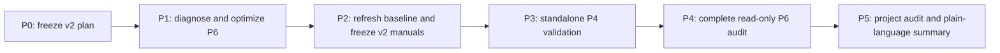

# TI 2026 Group 40-Roll playbook v2 implementation

Status: P0-P4 complete; P5 project audit and plain-language summary is next

- Plan freeze date: 2026-08-07
- Starting `main`: `5d701c9e56bfb73a3436b85273f404946ed628bc`
- v1 evidence cutoff: `2026-08-06T08:15:00Z`
- Primary product: two independently derived Human Roll playbook editions and their evidence package

## Objective

Produce a v2 Rate-agnostic playbook and a v2 Primary-model playbook whose published rules are
independently explainable, independently validated and fully cross-audited. The preferred outcome
is `baseline-reliable`; an honestly evidenced `draft` is still a completed empirical result.

The v2 engineering target is a cached-snapshot formal run below two hours: P4 standalone validation
at or below 30 minutes and the complete P6 matrix at or below 60 minutes. Initial replay acquisition,
manual user time and implementation time remain outside this analysis timer.

## Stage protocol

Every stage follows the same order:

1. synchronize `main`, confirm the complete repository state and freeze the stage plan;
2. state the stage objective, minimum change boundary and acceptance criteria;
3. implement only that minimum change;
4. run focused tests and the declared acceptance gate;
5. run project-level regression review, then remove only a verified superseded path;
6. record successful or failed empirical results, commit, push the stage branch, merge it directly
   into `main`, and push `main`.

A failed empirical gate does not justify hidden scope expansion. The stage is merged with its exact
failure report, completed implementation and retained safety boundaries. Destructive history
rewrites, client automation and silent changes to frozen evidence are forbidden.

## Non-negotiable boundaries

- v1 files, hashes and `draft` conclusions remain immutable historical evidence.
- All data, rules, validation and report entry points require explicit UTC `as_of`.
- P1 native replay counters remain the formal source for Madstone, Smoke, Watcher, Lotus and
  Tormentor. Diagnostic proxies never fill an exact `null`.
- V2 rule derivation may use governed P1-P3 arithmetic, client-visible semantics and v1 P4
  manual-route evidence. It may not use P5/P6 solver action traces to generate, select or patch a
  rule.
- The two playbook editions, Reference Roll solver and Interactive Roll advisor remain separately
  versioned products. Disagreement remains visible.
- No full P5 run is part of v2. The measured 29.58-hour projection remains a failed diagnostic, not
  a work queue.
- Main, Steam credentials, Dota client control, automatic prediction entry and non-local web bind
  remain out of scope.

## Dependency order

P1 may use only frozen v1 fixtures and outputs. This lets performance work finish before v2 rule
derivation without exposing the manual route to new solver evidence.

## P0 — Plan and clean baseline

### Objective

Freeze scope, evidence separation, runtime budgets, stage gates and Git delivery behavior.

### Minimum change

Add this plan only. Do not change production code, configuration, evidence or domain terminology.

### Acceptance

- current `main` and `origin/main` identities are recorded;
- full offline Python tests, Ruff, format, lock and dependency checks pass;
- every later stage has an objective, minimum change and acceptance gate;
- repository diff is documentation-only and contains no generated artifact.

## P1 — P6 performance diagnosis and semantic-preserving optimization

### Objective

Make the frozen 108-row read-only audit computationally feasible without changing any action,
distribution, mean, CVaR, release threshold or route-separation rule.

### Minimum change

Touch only the exact fixed-offer oracle, cross-audit orchestration, focused tests and the P1 report
when a measured bottleneck requires it. Do not modify either manual, P3 values, Roll rules, P5
policy semantics or v1 evidence.

Follow the hard-bug diagnosis loop:

1. create a deterministic, seconds-scale, red-capable performance harness for the broad
   `horizon=3` state pattern;
2. minimize it and record baseline work/time counters;
3. test ranked hypotheses one variable at a time;
4. add a regression test before the semantic-preserving fix;
5. compare optimized and legacy outputs field-for-field on fixed fixtures.

Candidate optimizations may include cross-call subproblem reuse, equivalent-branch probability
aggregation, action-distribution reuse across risk tolerances and deterministic row parallelism.
They are hypotheses, not pre-authorized implementation scope.

### Acceptance

- the focused harness is deterministic and catches the original branch explosion;
- fixed oracle and P6 outputs are numerically identical to the frozen implementation;
- the 108-row v1 matrix completes inside 60 minutes, or the exact remaining blocker is reported;
- focused and full offline tests, Ruff and formatting pass;
- no debug instrumentation, throwaway prototype or unverified legacy path remains.

Result: complete under the explicit blocker-report branch. The semantic-preserving matcher pruning
raised formal P6 throughput by about 12.3x, while the frozen 30-minute stop still ended v1 at
84/108 rows. See
[`group-roll-playbook-v2-p1-performance-2026-08-07.md`](../reports/group-roll-playbook-v2-p1-performance-2026-08-07.md).

## P2 — Current baseline and independently frozen v2 manuals

### Objective

Build two concise v2 candidate manuals from governed manual-route evidence, with a current explicit
baseline and no solver-derived rule.

### Minimum change

- verify the current local client Rule snapshot;
- choose and record a new UTC `as_of`;
- incrementally ingest only newly eligible evidence, if any, and reproduce P3;
- add versioned v2 playbook configurations and Markdown manuals;
- add only the production code needed to express independently justified v2 rules.

The Rate-agnostic route begins from the cross-model-supported RA01/RA03/RA08 principles and must
address the v1 RA06/RA10/RA12 material failures without case-specific branches. The Primary-model
route begins from the independently supported PM05/PM12 principles; the shadowed PM10 path is not
carried forward as a published rule. Other v1 rules must be independently merged, narrowed,
reclassified or omitted.

### Acceptance

- P1-P3/rule/data identities and the new explicit `as_of` are recorded;
- all formal Stat inputs are `exact` or accepted `derived`; proxy and unavailable values fail closed;
- each edition has no more than twelve ordered rules, three visible conditions per rule, three
  rounded Roll phases and one generic refresh fallback;
- nested 8/12/16 candidates and risk overlays are preregistered;
- rule/config/manual semantic hashes are frozen before P3 validation starts;
- production manual modules do not import the solver or cross-audit routes.

Result: complete. The current-rule/current-`as_of` baseline was reproduced without a replay
redownload, both v2 candidates were independently frozen with fail-closed provenance and a
self-checking hash manifest, and no P5/P6 action source entered derivation. See
[`group-roll-playbook-v2-p2-independent-freeze-2026-08-07.md`](../reports/group-roll-playbook-v2-p2-independent-freeze-2026-08-07.md).

## P3 — Independent standalone validation

### Objective

Run the complete v2 manual-only P4 protocol and assign honest per-edition P4 labels.

### Minimum change

Add a v2 validation policy, only the compatibility needed to load v2 manuals, deterministic report
generation and the resulting versioned evidence. Do not inspect new P5/P6 action traces and do not
patch a rule after confirmation results are known.

### Acceptance

- screening and confirmation use explicitly disjoint scenario indexes and a new seed;
- all nine Starting-state coverage strata per role and complete 40-Roll sessions are evaluated;
- Expected Group score, CVaR10, fallback/activation frequency, 8/12/16 complexity, risk frontier,
  per-rule ablation and Common-situation loss bounds are reported;
- every published Core rule has one-sided 95% no-loss support in mean and CVaR10 with strict point
  improvement in at least one;
- every published risk overlay respects its mean-retention tolerance and has one-sided 95%
  CVaR10-improvement support;
- Primary-model has no Common 10% failure under the Primary model;
- Rate-agnostic has no Common 10% failure under Primary, Flattened or Sharpened models;
- 5% strict results are reported separately;
- formal runtime is at or below 30 minutes, or an exact performance failure is reported.

An edition that misses any release condition remains `draft`; its failed evidence is still a valid
and mergeable stage result.

Result: complete under the explicit failed-gate branch. The frozen candidates completed 34,560
full sessions in 25m32s. Rate-agnostic had 23 baseline-10-percent Common failures and only four
rules supported across all release models. Primary-model retained zero baseline failures and
supported seven rules, but five core ablations and both active risk overlays failed. Both remain
`draft`; no rule was changed. See
[`group-roll-playbook-v2-p3-standalone-validation-2026-08-07.md`](../reports/group-roll-playbook-v2-p3-standalone-validation-2026-08-07.md).

## P4 — Complete read-only cross-audit and release labels

### Objective

Run a complete held-out comparison of each frozen v2 manual, the separately versioned bounded solver
and the conditional exact oracle, then assign the evidence-package release labels.

### Minimum change

Add a v2 cross-audit policy and evidence/report packaging. Reuse P1's semantic-preserving performance
implementation. Do not revise either manual or automatically activate the Full planner.

### Acceptance

- P6 held-out scenario indexes have zero overlap with P4 and the recorded P5 validation indexes;
- the preregistered matrix completes 108/108 rows within 60 minutes;
- source, rule, model, manual and scenario hashes match frozen inputs;
- manual hashes remain unchanged;
- every disagreement, unresolved decision, 5% warning and 10% significant exception is disclosed;
- per-edition labels are derived only from P3 and P4 gates;
- the versioned evidence package contains every governed input, output, limitation and runtime.

Result: complete. The new held-out audit finished all 108/108 rows in 44m48.6s, with zero overlap
against both v2 standalone and recorded P5 indexes. Rate-agnostic had no baseline material exception
in this conditional matrix; Primary-model had one directionally wrong Common case. Both retain their
standalone `draft` labels and no rule was changed. The 30-minute soft target failed, the 60-minute
hard ceiling passed, and P3 plus P4 finished in 1h10m21s. See
[`group-roll-playbook-v2-p4-read-only-cross-audit-2026-08-07.md`](../reports/group-roll-playbook-v2-p4-read-only-cross-audit-2026-08-07.md).

## P5 — Project audit, verified cleanup and plain-language report

### Objective

Verify that v2 did not break unrelated workflows, remove only verified superseded v2 implementation
paths, close the evidence package and publish a separate easy-to-read summary.

### Minimum change

Update indexes/runbook/advisor compatibility only where v2 identities require it. Keep v1 historical
artifacts. Remove a superseded production path only after its replacement passes focused and full
verification.

### Acceptance

- full offline Python tests, Ruff, format, lock and dependency checks pass;
- replay parser build is rechecked when its source or contract changed; otherwise its frozen JAR
  identity is verified;
- `ti rules validate` and relevant artifact audits report no new blocking issue;
- deterministic reruns reproduce semantic and file hashes;
- repository review confirms no future leakage, proxy fallback, solver-to-manual writeback, client
  automation, non-local bind or Main support regression;
- targeted searches find no temporary debug tags or superseded v2 production references;
- `docs/reports/group-roll-playbook-v2-summary-2026-08-07.md` explains the outcome, how to use the
  manuals, measured improvement, runtime and remaining limitations without solver terminology being
  presented as user-facing guidance.

## Expected improvement and honest ceiling

- The known v1 candidate family leaves less than about 1% mean-score headroom and roughly 0-2.5%
  lower-tail headroom. V2 is not expected to create a large honest average-score jump.
- The primary target is evidence quality: move from two Primary-model and three cross-model
  Rate-agnostic ablation-supported rules to 100% support among whatever rules are actually published.
- Rate-agnostic must reduce five baseline-significant Common failures to zero; its observed maximum
  CVaR10 loss upper bound must fall from 12.34% to at most 10%. Five percent remains a stretch tier.
- Primary-model already has zero 10% Common failures; its main gap is rule ablation. Its observed
  6.73% maximum CVaR10 loss upper bound makes baseline reliability more plausible than strict
  reliability.
- P6's observed partial throughput linearly projects to about 7.9 hours. Completing 108 rows inside
  60 minutes requires eliminating broad-state outliers while preserving exact results.

These are preregistered targets, not promises. Every miss remains visible in the merged report.
