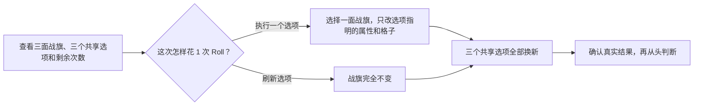

# Group 40 Roll 玩家手册（7.41e 权重更新版）

状态：**可公开查阅的保守说明版；不是已经通过可靠性门禁的完整策略**

- 适用范围：TI 2026 小组赛（Group）的三面三格战旗与 40 次 Roll；不适用于 Main。
- Stat 与 Title 数据截止：`2026-08-08T13:12:00Z`；Roll 规则验证仍截止于 `2026-08-06T17:27:00Z`。
- 使用方式：先理解机制，再从高确定度规则往下看；不满足条件就跳过。
- 发布边界：两份完整 v2 候选仍为 `draft`，本手册没有把它们改名为可靠策略。
- 权重更新：7.41e 单局证据额外乘 1.5；其他大版本、赛事目录等级与时间衰减保持不变。

本版重新计算了 Stat、队伍 Top 3 和 Title，但没有重新跑约 70 分钟的完整 Roll 规则交叉审计。
因此 B/C/D 级操作规则仍引用冻结的 v2 验证结论；不要把数值查表更新误读成整套策略重新认证。

## 一页结论

每次 Roll 都是在下面两件事中选一件：

1. 把当前三个选项之一用在一面战旗上；
2. 不改战旗，只花一次 Roll 换掉三个选项。

两种做法都消耗 1 次 Roll，而且之后三个共享选项都会全部换新。不要预先安排“先洗 Stat、
再洗品质、最后洗 Trait”的固定阶段；每次看到新结果和新选项后，都要重新判断。

本手册最短的实际用法是：

1. 优先检查 B 级的四条跨模型支持规则；
2. 如果没有命中，而且你接受当前主模型，再检查 C 级规则；
3. D 级规则不作为默认操作；
4. 没有清楚命中时，刷新三个选项。

这是一种按证据强弱整理的保守查阅顺序，不是已经证明全局最优的 40 步策略。

## 实战决断版：按顺序操作

这一节是实际操作入口，优先级高于后面的解释。这里的“接受”表示当前证据支持该动作的长期平均
方向，不保证这一次随机结果一定提高。Trait 小节中的“可追”是更窄的一步算术门槛；它不是已经
通过整段 40 Roll 复测的新核心规则，每次只允许尝试一次，看到结果和新选项后必须重新判断。

### 第 0 步：剩余 10 次或更少时，先执行末期硬规则

**只有这次操作无论随机到哪一种结果，整面战旗三格合计的预计总分都不会比现在低，才接受；只要
有一种结果会变低，就刷新。** 这条覆盖下面所有 Stat、Tier 和 Trait 规则。确定的“随机一格
Tier +1”不会降级，因此仍可接受；普通重随不满足这一条件。

### 第 1 步：Stat 只接受明确列出的组合

剩余至少 11 次，并且选项**只重随指定的一格 Stat**时：

| 位置与颜色 | 当前 Stat | 判断 |
| --- | --- | --- |
| 中单 · 蓝色 | 瞭望台、假眼、诡计之雾 | **直接接受** |
| 中单 · 绿色 | 眩晕、信使、Roshan | **直接接受** |
| 辅助位 · 绿色 | 信使、眩晕 | **直接接受** |
| 辅助位 · 绿色 | Roshan | **只有重新同队匹配后，完整战旗平均分明确上升才接受；无法计算就拒绝** |
| 其他位置、颜色或 Stat | 任意 | **默认拒绝**；只有能证明完整战旗平均分上升，且不碰“可以保留/一定保留”格时才例外 |

以上“直接接受”仍要求该 Stat 在最新表中保持**分档稳定**。如果表中显示“分档边界”、选项会同时
影响多格、或者会碰到“可以保留/一定保留”的 Stat，一律不套用本表；无法完成同队重新匹配时也
拒绝。核心位当前没有达到“直接接受”门槛的组合。

### 第 2 步：Tier 只抓确定升级，不把普通重随当升级

| Tier 选项 | 判断 |
| --- | --- |
| 随机一格 Tier +1 | 目标战旗尚未全 T5 时，**接受**；优先给低 Tier 较多且基础贡献较高的战旗 |
| 普通单格或指定颜色 Tier 重随 | **默认拒绝**；即使当前是 T1/T2，也没有通过“见到就洗”的整局验证 |
| 整色 Tier 重随 | 剩余至少 11 次、不破坏使现有 Fractal 生效的 Tier 全异结构，并且计算后完整战旗平均分上升才接受 |
| 两格升级、一格降级 | 只在剩余 26–40 次、三格都不高于 T2、任一格不超过战旗基础贡献的 45%，且完整战旗平均分上升时接受；缺一项就拒绝 |

### 第 3 步：Trait 只从“两件成形”开始追

先把三格在**已经计入 Stat 和 Tier、尚未计入 Trait**时的贡献记为 `B1、B2、B3`，并令
`E=B1+B3`、`M=B2`、`S=E+M`。当前 Trait 增量按下表相加：

| Trait 所在位置 | 左格 | 中格 | 右格 | 生效条件 |
| --- | ---: | ---: | ---: | --- |
| Fractal | `0.6B1` | `0.6M` | `0.6B3` | 三格 Tier 两两不同；**每个 Fractal 独立生效** |
| Benevolent | `0.2M` | `0.2E` | `0.2M` | 始终生效，分数加给相邻格 |
| Vampiric | `0.5B1-0.1M` | `0.5M-0.1E` | `0.5B3-0.1M` | 始终生效 |
| Unique | `0.3B1` | `0.3M` | `0.3B3` | 整面战旗恰好只有一个 Unique |
| Friendly | `0.5B1` | `0.5M` | `0.5B3` | 三格全部是 Friendly |

**不是三个 Friendly 永远最优。** 三格 Trait 恰好相同时：

| 三格相同 | Trait 总增量 | 结论 |
| --- | ---: | --- |
| Friendly / Friendly / Friendly | `0.5S` | Tier 不全异且贡献均衡时的通用目标 |
| Fractal / Fractal / Fractal | Tier 全异时 `0.6S`，否则 `0` | Tier 全异时明确高于三个 Friendly |
| Vampiric / Vampiric / Vampiric | `0.4E+0.3M` | 始终低于三个 Friendly，不追第三个 Vampiric |
| Benevolent / Benevolent / Benevolent | `0.2E+0.4M` | 始终低于三个 Friendly |
| Unique / Unique / Unique | `0` | 不要追 |

例如三格贡献都是 100：Tier 不全异时，三个 Friendly 增加 150，而 `V/B/V` 只增加 120；此时
Friendly 最好。Tier 全异时，三个 Fractal 增加 180，高于 Friendly 的 150；此时 Friendly 就不是
最优。

最终配方可用下面两条精确判断：

- **Tier 两两不同**：每个侧格在 `B侧 ≥ M/3` 时选 Fractal，否则选 Benevolent；中格在
  `M ≥ E/3` 时选 Fractal，否则选 Benevolent。此时 Friendly、Vampiric 和 Unique 都不是理论
  最优目标。
- **Tier 不是两两不同**：先算三个 Friendly 的 `0.5S`；再对每个侧格比较 Vampiric 的
  `0.5B侧-0.1M` 与 Benevolent 的 `0.2M`，对中格比较 Vampiric 的 `0.5M-0.1E` 与
  Benevolent 的 `0.2E`。三个位置各取较大值后求和；只有这个和严格大于 `0.5S`，才采用对应的
  B/V 混合配方。对称的两种特例是：`V/B/V` 需 `E>3.5M`，`B/V/B` 需 `M>1.5E`。

实际花 Roll 追 Trait 时，**以下五项必须同时满足**；全部满足才允许尝试一次，失败后不得照原计划
连点，必须根据新状态重新计算：

1. Stat 已经没有“优先改善”项，也没有当前可拿的确定 Tier +1；
2. 剩余至少 11 次 Roll；
3. 目标配方已经有两格正确，只差一格；
4. 当前选项能只重随缺口格，不会碰另外两格；
5. 把缺口格分别变成五种 Trait 后，五种情况下整面战旗预计总分的平均值严格高于当前分数。

第 5 项必须真的算五种结果：`平均值=(Fractal结果 + Benevolent结果 + Vampiric结果 + Unique结果 +
Friendly结果)/5`。当前声明模型把五种结果视为等概率，所以指定 Trait 每次为 `1/5=20%`；连续
`k` 次都能精确重随缺口格时，至少成功一次的概率是 `1-0.8^k`：

| 精确尝试次数 | 1 | 2 | 3 | 4 | 5 | 8 |
| --- | ---: | ---: | ---: | ---: | ---: | ---: |
| 追到指定 Trait | 20.0% | 36.0% | 48.8% | 59.0% | 67.2% | 83.2% |

“已经两个 Friendly”仍不是自动接受。假设 Tier 不全异：

- 三格贡献都是 100，另外两格是 Friendly，缺口当前为 Unique：当前 Trait 增量为 30；精确洗缺口
  后五种结果为 `0、20、40、30、150`，平均 48，高于 30，可以尝试一次。
- 缺口侧格贡献 500，中格和另一侧各 50，另外两格是 Friendly，缺口当前为 Vampiric：当前增量
  为 245；五种结果为 `0、10、245、150、300`，平均 141，低于 245，必须拒绝。

缺两格时，即使把 10 次精确尝试平均分成 `5+5`，两格都成功也只有
`(1-0.8^5)^2=45.2%`。因此从零件或一件开始追完整套装，一律拒绝；已经两件成形也不能因为
“差一件”自动点击，仍须通过五结果平均值。

按当前客户端权重主模型，从一个新选项组中看到可精确洗缺口格的 Trait 选项，概率约为：中单
红/绿格或任一战旗的绿色格 `17.7%`，中单蓝格 `49.1%`，辅助某一个指定蓝色侧格 `10.9%`。
再乘 `20%` 的目标结果率，
如果只靠刷新硬找，平均会消耗约 `28.2 / 10.2 / 45.8` 次 Roll。因此**只在合适选项已经出现时
考虑追，不为 Trait 连续刷新**。这些出现率使用客户端暴露权重的主模型，不是 Valve 公布的精确
随机算法。

不同战旗的“只洗缺口格”能力也不相同：

| 战旗 | 可以精确追的缺口 | 不能这样追的缺口 |
| --- | --- | --- |
| 核心位（红/绿/红） | 中间绿色 | 任一红色侧格；红色 Trait 选项会同时洗两侧 |
| 中单（红/蓝/绿） | 三格都可以 | — |
| 辅助位（蓝/绿/蓝） | 中间绿色；有“第一个/最后一个蓝色”时可追对应侧格 | “随机一个蓝色”不算精确，会误伤另一侧 |

具体配方的追法：

- **Friendly**：只有已经有两个 Friendly，且能精确洗第三格时才进入计算；从零个或一个不追。
- **Fractal**：Tier 全异时，一个 Fractal 就已经生效，不必等三个；已有两个且能精确洗缺口时，
  再按五结果平均值决定是否追第三个。
- **Vampiric**：终局目标最多两个，绝不追第三个。均衡左右时常见目标是两侧的 `V/B/V`；
  `B/V/B` 只需要中间一个 Vampiric。左右贡献很不对称时也可能是 `V/V/B` 或 `B/V/V`，必须用
  上面的逐格 B/V 公式决定，不能只数 Vampiric 个数。只有目标配方已有两件时才追缺口。
- **Unique**：从零个开始永远不主动追；它是意外抽到后的单件保底。恰好一个时可保留；出现两个
  或更多时绝不继续追，若有精确单格选项，只考虑重随贡献较低的重复 Unique。重随后恢复为恰好
  一个 Unique 的模型概率是 `4/5=80%`，但仍须满足剩余至少 11 次和五结果平均值为正。

### 第 4 步：统一拒绝基准

命中下面任意一条，就拒绝该选项并刷新：

- 剩余 10 次或更少，且存在任何一种合法结果会降低完整战旗；
- 会改动“可以保留/一定保留”Stat，或目标 Stat 处在分档边界；
- 选项同时影响多格，但无法重新计算完整战旗并完成同队匹配；
- 普通 Tier 重随被误当成确定升级；
- 从零件或一件开始追 Trait 套装、当前选项不能只洗缺口格，或试图凑两个 Unique；
- 条件规则要求“平均分上升”，但当前无法算出严格大于 0 的改善。

没有命中“直接接受”，也无法满足条件接受时，就刷新三个选项。刷新同样消耗一次 Roll，但比在
证据不足时破坏已有战旗更符合本手册的保守目标。

后文 B/C/D 分层继续保留实验依据和失败原因，不再增加新的“直接接受”例外；如果后文旧措辞比
本节宽松，以本节的接受表和拒绝线为准。

## Roll 之外先选 Title

Title 不属于 40 次 Roll：它单独选择 1 个 Prefix 和 1 个 Suffix，对三面 Fantasy 战旗生效，
更换不消耗 Roll。没有三面最终战旗信息时，当前默认选择是：

- **Prefix：Cerulean**；
- **Suffix：the Clutch**。

Cerulean 是 48 个“队伍×位置”池的中性平均第一，并在 16 个池里第一，因此它是默认答案，
不是任何阵容都固定最优。the Clutch 在 34/48 个池里是 Suffix 第一，方向更稳定。截图中的
Otherworldly 综合排第 3，尚可继续使用；the Flayed Twins Acolyte 的客户端条件存在冲突，应优先
换成 the Clutch。

完整触发率、八个 Prefix、八个 Suffix 和可信度说明见
[Title 分析与推荐](../../reports/ti2026-fantasy-title-recommendation-2026-08-09.md)。最佳顺序是先完成
三面战旗与队伍匹配，再利用免费更换机会复查 Title；无法个性化重算时才直接使用默认组合。

## 确定度怎么读

| 层级 | 含义 | 能否直接当操作规则 |
| --- | --- | --- |
| S · 机制已确认 | 来自当前客户端规则快照，说明 Roll 实际怎样运作 | 是机制事实，不负责判断收益 |
| A · 查表证据扎实 | Stat 排名、Quality 和 Trait 的受控计算 | 用来判断当前状态，不等于自动点击 |
| B · 跨模型支持 | 单独拿掉这条规则再整局复测，它在三种模型下都显示有用 | 当前最优先参考的操作规则 |
| C · 主模型支持 | 单条规则只在当前 best-guess 主模型下通过 | 接受模型假设且能算完整战旗收益时参考 |
| D · 暂不采用 | 有方向性反例、消融失败或整版门禁失败 | 不作为默认规则 |

这里的层级不是“90% 正确”一类概率，也不能相加。它表示我们拥有哪一种证据，以及证据覆盖
到什么范围。S/A 级内容能在固定规则、数据和模型下重复算出，但仍不是对未来比赛结果的保证。

## S 级：Roll 机制

### 1. 你实际在操作什么

Group 有三面战旗：核心位、中单和辅助位。每面战旗有三格，每格徽标都由三部分组成：

- **Stat**：这一格计算什么比赛数据；
- **品质**：T1 到 T5，对基础 Stat 分数提供加成；
- **Trait**：根据三格的位置、品质和组合产生额外效果。

三面战旗的颜色顺序固定：

| 战旗 | 第 1 格 | 第 2 格 | 第 3 格 |
| --- | --- | --- | --- |
| 核心位 | 红 | 绿 | 红 |
| 中单 | 红 | 蓝 | 绿 |
| 辅助位 | 蓝 | 绿 | 蓝 |

### 2. 三个选项是共享的

屏幕上的三个 Roll 选项同时供三面战旗使用。执行时需要选择“哪一个选项”和“用在哪一面
战旗上”。选项只修改被选择的那面战旗，不会同时修改另外两面。

### 3. 选项会怎样修改战旗

常见选项包括：

- 重随指定颜色的一格或多格 **Stat**；
- 重随指定颜色的一格或多格 **品质**；
- 重随指定颜色的一格或多格 **Trait**；
- 随机选择一格，品质提高一级；
- 随机选择一格降一级，另外两格各升一级。

属性重随只替换被点名的属性，另外两个属性保留。重随结果可以与原来相同；品质最低为 T1、
最高为 T5。“随机 +1”命中 T5 时不会再提高；“二升一降”也可能因为下降格很重要而造成净损失。

后文会反复用到三个说法：

- **整面战旗预计总分**：把三格 Stat、品质、Trait 和同队匹配合在一起算出的预计分数；
- **最差结果也不掉分**：把客户端允许出现的每一种随机结果逐个检查，其中最差的一种也不比
  当前三格合计的预计总分低；
- **平均改善为正**：考虑各种可能结果后，平均分比当前更高；它不保证这一次实际操作一定涨分。

### 4. 刷新不是免费跳过

刷新会让战旗保持原样，但仍消耗 1 次 Roll，并把三个选项全部换掉。它保护了当前战旗，代价是
少一次未来操作机会。因此“刷新”是安全兜底，不是无成本动作，也不是全局最优保证。

### 5. 最后才做同队匹配

三格完成后，每面战旗要由同一支队伍兑现。不能把三个 Stat 各自的队伍第一名拼成一面战旗。
因此真正比较一个 Roll 选项时，要看完整战旗和重新匹配后的队伍，而不是只看某一格立即涨了多少。

### 6. 前期、中期、末期只是手册分段

- 前期：剩余 40–26 次；
- 中期：剩余 25–11 次；
- 末期：剩余 10–1 次。

这三段是为了让人工规则容易记，不是客户端强制的 Stat、品质或 Trait 阶段。

## A 级：先判断当前三格值不值得动

### Stat：看排名、基础建议和分档状态

完整 42 项排名见
[各 Stat 推荐队伍 Top 3 发布表](stat-team-top3-publication-v3.md)。发布表的四档含义是：

| 基础建议 | 通俗含义 |
| --- | --- |
| 一定保留 | 本表最强且极难由其他队伍替代；当前数据中没有这一档 |
| 可以保留 | 相对强度不低于 84.6，通常不值得主动破坏 |
| 可以改善 | 相对强度在 44 到 84.6 之间，有合适的精确机会再动 |
| 优先改善 | 相对强度低于 44，是更值得修复的 Stat |

“分档边界”表示重采样后可能跨到相邻档。需要“稳定”作为条件的规则，遇到边界项就不要套用。

当前最容易认出的修复对象是：

- 中单蓝色的瞭望台、假眼和诡计之雾：都是稳定的“优先改善”；
- 辅助位绿色的 Roshan：是稳定的“优先改善”；
- 核心位绿色的眩晕和信使虽然也是“优先改善”，但都在分档边界，不能当稳定项处理。

### Quality：品质越高不等于任何重随都值得

| 品质 | 当前基础加成 |
| --- | ---: |
| T1 | +10% |
| T2 | +30% |
| T3 | +60% |
| T4 | +100% |
| T5 | +150% |

当前主模型下，随机重随一格品质后的平均加成是 44.68%，所以只看这一格的数学期望时，T1/T2
有上升空间，T3 及以上没有。但这还没计算一次 Roll 的机会成本、Trait 是否被破坏以及完整战旗
重匹配，所以它不是“见到 T1/T2 就洗”的操作规则。

不假设出现率时，只有 T1 的随机品质重随能保证结果不比当前品质更低。“随机 +1”不会降级；
“二升一降”必须看三格基础贡献，不能当成固定收益。

### Trait：只看完整三格配方

令两侧格的未计 Trait 贡献之和为 `E`，中间格贡献为 `M`：

| 配方 | 什么时候有价值 |
| --- | --- |
| 三个 Friendly | 三格贡献比较均衡时的通用完整套装 |
| Fractal / Benevolent 混合 | 三格 Tier 两两不同时逐格比较；一个 Fractal 也能独立生效 |
| Vampiric / Benevolent / Vampiric | 两侧贡献极高；要超过 Friendly 需 `E > 3.5M` |
| Benevolent / Vampiric / Benevolent | 中间贡献极高；要超过 Friendly 需 `M > 1.5E` |
| 单个 Unique | 无法组成完整套装时的过渡填充；不主动追，两个 Unique 都不会生效 |

完整公式、理论最优配方和追逐概率见前面的“第 3 步”。这些配方能说明“当前组合值多少”，不能
单独证明“现在值得花一次 Roll 去追”；实际点击还必须满足“两件成形、精确洗缺口、五结果平均
改善为正”。

## B 级：跨模型支持的四条规则

以下四条在三种声明的 Roll 模型下都通过了配对整局消融。它们按原生成率无关手册中的相对
先后关系排列；这不代表把其余规则删掉后，四条本身已经构成一套重新验收过的完整手册。

### 1. 看见随机 +1 品质，优先拿不会降级的提升

如果某面战旗还不是三格全 T5，可以把“随机一格品质 +1”用在它上面。优先选择低品质较多、
同时基础贡献较高的战旗。它可能命中 T5 而不变，但不会把任何格降级。

### 2. 精确修复中单的单格蓝色差 Stat

中单只有一格蓝色。如果当前是稳定“优先改善”的瞭望台、假眼或诡计之雾，而且选项只会重随
这一格，可以优先修复。不要把这条扩大到分档边界或同时影响多格的选项。

### 3. 最后十次，只接受所有结果都不降的动作

剩余 10 次或更少时，未来补救空间很小。只有当该选项的每一个合法结果都不低于当前完整战旗
分数时才执行；否则刷新三个选项。这里看的是完整战旗，不是单格品质或 Stat 名称。

### 4. 前中期精确改善稳定的绿色“可以改善”项

剩余至少 11 次、当前绿色 Stat 是非边界的“可以改善”、并且选项只动这一格时，可以考虑精确
重随。边界项不使用本规则；会同时碰到其他格也不使用。

## C 级：只在接受主模型时参考

这一层的规则在当前“最可能的出现率模型”下显示有用，但没有取得 B 级的跨模型支持。只按
“平均分优先”判断：必须确认完整战旗重新匹配后的平均改善大于 0。没有计算工具或无法判断时，
直接跳过并刷新。

### 1. 精确修复稳定的绿色“优先改善”项

剩余至少 11 次、目标为非边界绿色“优先改善”、选项只动该格且完整战旗期望改善为正时使用。
当前直接对应辅助位绿色 Roshan；核心位绿色眩晕和信使是边界项，不满足条件。

### 2. 单格 Stat 重随

剩余至少 11 次，选项只影响一个 Stat，并且完整战旗的主模型期望改善为正时才用。Stat 表中的
“可以改善/优先改善”只是筛选起点，不能代替完整战旗计算。

### 3. 两格 Stat 重随

剩余至少 11 次，受影响两格中没有“一定保留”，两格合计后的完整战旗期望改善为正时才用。
不能把两个单格的最佳队伍分数直接相加，必须重新做同队匹配。

### 4. 整色品质重随

剩余至少 11 次，不破坏使现有 Fractal 生效的 Tier 全异结构，并且完整战旗期望改善为正时才用。
“受影响格看起来品质低”本身不够。

### 5. 前期低品质二升一降

只在剩余 26–40 次时考虑；三格都不高于 T2，任一格基础贡献不超过三格总和的 45%，而且完整
战旗期望改善为正。随机下降格可能很重要，所以不满足任一条件就跳过。

## D 级：当前不要作为默认规则

### 最后十次的主模型正期望规则

这条在 standalone 消融中通过，但只读审计发现一个剩余 3 次时同时劣于直接刷新的方向性反例。
发布手册因此采用 B 级的严格版本：末期只拿“即使抽到最差结果，三格预计总分也不下降”的动作。

### 见到 T1/T2 就精确重随品质

T1/T2 的单格品质期望低于主模型重随均值，是算术事实；但对应整局操作规则没有通过消融。
生成率无关版的前中期精确 T1 和前期整色全 T1 规则也没有取得跨模型支持。原因是一次 Roll 的
机会成本和组合破坏不能被单格均值覆盖，所以不要机械执行。

### 不计算就为了差一格追 Trait，或广泛重随 Trait

“只差一格套装”、精确 Trait、单格 Trait 和整色 Trait 的 Primary 发布规则均未通过消融；
生成率无关版中的多数 Trait 规则也未通过。前面新增的“两件成形”停止线没有把这些旧规则恢复为
跨模型核心规则；它只允许在精确保留另外两格、五结果平均值为正时做一次保守尝试。若不愿接受
这项一步期望假设，或无法完成五结果计算，仍应刷新。

### 把“所有结果不降”扩大到整个前中期

生成率无关版中，前中期分别检查 Stat、品质和 Trait“即使最差结果也不掉分”的三条规则没有通过
跨模型消融。眼前不降不等于整局不损失，因为它仍消耗一次 Roll。当前只把这一原则保留在通过
验证的末期规则中。

### 两个更保守的风险档

把操作门槛提高到 2% 或 5% 的两个风险档，在验证中同时降低了平均分和最差 10% 情形的平均分。
当前发布版只保留“平均分优先”作为条件参考，不声称提高门槛能改善下限。

### 整本照抄任一 v2 候选

Primary 有 7/12 条核心规则通过，但仍有 5 条失败和一个方向性反例；Rate-agnostic 只有 4/12
条取得跨模型支持，完整会话还有 23 个常见情形超过 10% 损失门槛。两本都不能作为已经证明
可靠或全局最优的完整策略。

## 每次 Roll 的保守检查表

1. **确认状态**：剩余次数、三面战旗、三项共享选项都以客户端当前画面为准。
2. **确认影响范围**：它改哪面战旗、哪种属性、哪一格或哪几格。
3. **先看 B 级**：严格满足原条件才使用，不做相似条件外推。
4. **再看 C 级**：只在接受主模型、采用“平均分优先”且能确认完整战旗平均改善为正时使用。
5. **避开 D 级默认操作**：算术上看似有利，不代表值得消耗一次 Roll。
6. **没有清楚命中就刷新**：保护当前战旗，接受少一次未来机会的代价。
7. **操作后从头判断**：确认真实结果和新的三个选项，不在一局内根据短样本修改出率假设。

如果 B、C 两层同时出现多个候选，本手册不声称拥有经过整体验证的冲突解决器。优先选择证据
层级更高的动作；同一层内仍无法明确比较时刷新。

## 使用边界

- 本手册只负责 Group，不适用于 Main；
- 不控制 Dota 客户端，也不自动填写结果；
- Coach 不在当前完整估值范围内；
- Stat 表用于缩小候选，最终仍要按每面战旗重新进行同队匹配；
- 确定度排序是发布层的证据整理，不是新的可靠性认证，也不是 40-Roll 全局最优证明。
