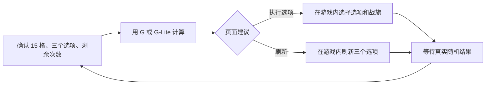

# Main 30 Roll 玩家手册（actual 八队版）

状态：**当前可用的五格求解器操作说明；G 为默认，G-Lite 为用户主动选择的实验性备选**

- 数据截止：`2026-08-16T15:31:30Z`
- Main 锁定：`2026-08-20T02:00:00Z`
- 队伍：Iron Wing、Team Liquid、Nigma Galaxy、TEAM VISION、BoomBoys、Team Falcons、
  Team Yandex、Team Spirit
- 求解发布：actual / ready，8 个候选即 8 个参赛队
- 适用范围：Main 三面五格战旗与 30 次 Roll；不适用于 Group 三面三格与 40 次 Roll

## 一页结论

每次计算都要完整输入：三面战旗共 15 格、同屏三个互不重复的 Roll 选项和剩余次数。默认选择
**G**，按页面建议在游戏内手动操作；完成一次实际操作后，重新读取或手填整个画面再算。不要提前
规定“前十次洗 Stat、后十次洗 Quality”之类的固定阶段。

云端 Streamlit 只允许手填；Windows 本地版可手填，也可一次性识别当前完整 Main 页面。两者
使用同一份冻结求解包，均不会点击、控制或自动填写 Dota。

## Main 画面结构

Main 有三面战旗，每面五格：

| 战旗 | 第 1 格 | 第 2 格 | 第 3 格 | 第 4 格 | 第 5 格 |
| --- | --- | --- | --- | --- | --- |
| 核心位 | 红 | 绿 | 红 | 绿 | 红 |
| 中单 | 红 | 蓝 | 绿 | 红 | 绿 |
| 辅助位 | 蓝 | 绿 | 蓝 | 绿 | 蓝 |

每格由 Stat、T1–T5 Quality 和五种 Trait 组成。同屏三个 Roll 选项供三面战旗共享：执行某个
选项时还要指定一面战旗；只改该战旗，但执行或刷新都会花 1 次 Roll，并把三个选项全部换新。

## 两种正式可选策略

### G：默认

G 枚举当前画面所有合法动作：三个选项分别应用到能够应用的战旗，以及直接刷新。对每种动作的
所有合法随机结果，使用当前主概率模型计算完整五格终局分、重新选择同队匹配，并比较一步后的
平均分和低迷分。它选择当前一步期望终局价值最高的动作。

G **不会猜未知的下一轮选项**，也不是把 30 步完整展开的全局动态规划。它的优势是每次都基于
已确认画面精确重算，速度稳定，且在现有 G/T/H 和后续轻量挑战研究中没有策略通过门槛取代它。

### G-Lite：可选

G-Lite 通常直接采用 G。只有 G 排名前两项的一步平均值差距不超过当前终局均值的 `0.05%`，
并且还有至少 2 次 Roll 时，才对这两个候选各生成 4 个固定 seed 的下一轮样本，再比较一次有限
二步值。只有二步优势至少达到当前终局均值的 `0.01%` 才会覆盖 G；每局最多触发 4 个不同画面。

G-Lite 的 100 个合成开发状态给出正向点估计，但尚未完成独立 confirmation。因此：

- 默认仍选 G；
- G-Lite 是用户主动选择，不是后台自动升级；
- 未触发时结果与 G 相同；
- “4 个下一轮样本”不等于完整 30 步搜索，也不保证单局更好。

先前研究过的 `0.10%` 歧义门槛、每局 5 次触发属于未晋级的开发配置，不是当前 Web 配置。

## 页面结果怎样读

页面先给一个明确动作，再显示四项量：

| 字段 | 含义 |
| --- | --- |
| 当前一步平均变化 | 当前主模型下，执行该动作相对保持现状的期望变化 |
| 当前一步低迷变化 | 最差 10% Main 情景平均值的变化 |
| 最差合法结果 | 该操作所有合法随机结果中的最差一步变化 |
| 最好合法结果 | 该操作所有合法随机结果中的最好一步变化 |

“平均变化为正”不代表每个随机结果都变好，所以最差合法结果可能为负。页面同时显示当前自动匹配
的核心、中单、辅助队伍；三面战旗可以选不同队，但同一面五格必须共同匹配一支队伍。若手动固定
队伍，求解器只在指定队伍下估值；不确定时使用自动匹配。

## Stat 表怎样配合求解器

[Main Stat 与队伍 Top 3 完整表](stat-team-top3-publication-v1.md)列出 42 个位置/颜色/Stat 行、
实际八队 Top 3 和 400 次 Series 分组重采样稳定率。它适合回答“这个 Stat 大致强不强、哪些队
更适合”，但不能代替当前画面计算：

1. 五格必须共同匹配同一队，不能把五个 Stat 的第一名拼起来；
2. Quality 与 Trait 会改变各格权重；
3. 一个 Roll 选项可能同时影响同色多格；
4. 剩余次数和当前另外两个选项会改变机会成本。

因此“一定保留 / 可以保留 / 可以改善 / 优先改善”是查表标签，不是固定点击规则。出现分档边界
或前三接近时，更应让 G/G-Lite 用完整五格重算。

## Title 在 Roll 之外单独处理

Title 免费更换，不消耗 30 次 Roll。当前 actual 八队的中性默认从 Group 阶段的
`Cerulean + the Clutch` 更新为 **Elemental + the Clutch**。Prefix 明显依赖最终三个队伍与位置，
所以先完成战旗和队伍，再复查 Title；完整触发率、排名、冲突项和 BO5 边界见
[Main Title 分析与推荐](../../reports/ti2026-main-fantasy-title-recommendation-2026-08-17.md)。

当前 G/G-Lite 终局值没有把 Title 联合优化进去。Title 报告是独立免费调整依据，不应把纸面触发
加成直接当成求解器总分提升。

## 随机模型与已知边界

当前客户端证据包含 20 个正权重 operation；每次从中按权重无放回抽出三个不同选项。主模型：

- Stat：同色六项等概率；
- Trait：五种等概率；
- Quality：使用客户端暴露的 T1–T5 权重；
- 多个合法目标：在合法目标集合中均匀选择；
- operation 24：均匀选择一个降级槽，再从其余四槽中均匀选择两个不同升级槽。

最后一条是明确假设：客户端公开了操作及 All target，但没有公布逐次目标出率。页面还保留
flattened / sharpened 两种权重敏感性用于动作一致性提示；它们不是 Valve 公布的真实出率。

Main Series 数来自完整双败 bracket 情景；单个 Series 的 Fantasy 表现仍以历史完整 BO2/BO3
块为 proxy，尚未精确拆分可能的 BO5 总决赛。当前实际八队、最新赛后 Fantasy pool、Main Elo
和 1.5× TI 已结束阶段权重均已进入发布包；projected 16 队结果不得混入。

## 为什么不沿用 Group B/C/D 操作表

Group 手册里的 B/C/D 是围绕三格、40 Roll 和冻结 Group 情景做的消融与交叉审计。Main 改成
五格、30 Roll、不同颜色位置和不同终局 Series 数后，那些固定组合没有重新认证。本手册不会把
旧规则换个标题后冒充 Main 结论。

Main 当前可发布的操作策略就是 G，另保留用户可选的 G-Lite。若未来要增加“看到某个 Stat 就
直接洗”一类人工捷径，必须在 Main 五格环境单独建立证据并通过门槛。

## 最短实战流程

1. 确认页面显示 `ready / actual`、数据截止 `2026-08-16T15:31:30Z`、可选队伍为 8；
2. 输入或识别完整 15 格、三个选项和真实剩余次数；
3. 保持默认 G；只有理解实验边界时才主动切 G-Lite；
4. 看明确动作、平均/低迷变化和当前三队匹配；
5. 在游戏内手动执行一次；
6. 不沿用旧结果，重新读取整个真实画面；
7. Roll 完成后，按实际三个队伍免费复查 Title。

## 发布身份

- Main release：`12a3f9cd869626fc42eb686ff87c5e667e48d01d43da4920129a534fd0147e34`
- Main release 文件：`40b91220e6329abe770cab1607a78e42f49326d1a075b53f0a5f0f7646921b5b`
- Main Scenario：`76a399cc00d0ba4389a06e0c74e3ddea2c3db7174734358149e2e0b953c22a88`
- 最新 Main Series pool：`e623437a7e1da94519a0bfd3b9c8680e3e0c5f7a9a2c09e873f40938e4eaab41`
- Main 玩家出版证据：`039e9c14dca244718e84f0c7c41bc04192abb287218d2c0386b6266ff292bba8`

这些身份不匹配时，先停止使用文档与页面的组合结果，重新发布或刷新服务；不要把不同时间点的
actual/projected、Stat、Title 和求解包拼在一起。
