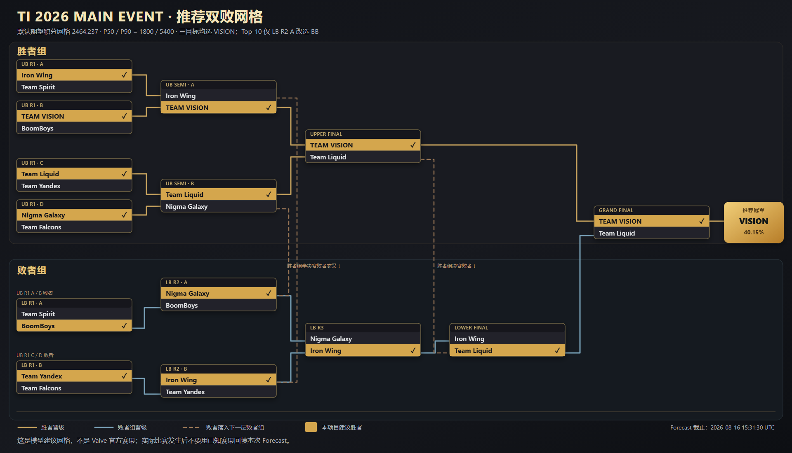

# TI 2026 玩家发布包（2026-08-17，Main Event actual 八队版）

这是面向 TI 2026 Main Event 的独立玩家发布版。实际八队、官方直播揭晓的胜者组首轮、
TI 小组赛与突围赛的最新数据，以及 Main 五格 Fantasy 求解发布均冻结在
`2026-08-16T15:31:30Z`。Group 发布包保持不变，不再承担 Main 的当前推荐。

状态：**五格 Main 求解包为 `ready / actual`；淘汰赛 Forecast 与无个人画面的通用 Fantasy
基准为 `warning`，没有 blocking issue。** 所有概率与建议均为本项目的模型输出，不是 Valve
官方赛果。

## 先看结果

- 三个淘汰赛目标枚举完整 `16,384` 个合法双败网格后都推荐 **TEAM VISION 冠军**，冠军
  边际概率 **40.15%**。期望积分与 Top-100 代理给出同一完整网格；Top-10 代理只在败者组
  第二轮 A 改选 BoomBoys 胜 Nigma Galaxy。
- 建议决赛路径为：胜者组决赛 TEAM VISION 胜 Team Liquid；败者组决赛 Team Liquid 胜
  Iron Wing；总决赛 TEAM VISION 胜 Team Liquid。
- 默认完整网格的期望活动积分为 **2464.237**，分布 P50 / P90 为 **1800 / 5400**。
- 作为对照，在 `16,384` 个拓扑自洽网格中均匀乱填的期望只有 **3.7500 / 14** 个正确节点、
  **1367.525** 分；当前推荐为 **5.4122 / 14**、**2464.237** 分，积分期望提升 **80.20%**。
- 无个人战旗画面时的通用 Fantasy 基准为：**VISION Core + Nigma Mid + Nigma Support**。
- 有个人画面时，应在 Web 手动录入 Core / Mid / Support 共 15 格，再用 **G（默认）**或
  **G-Lite（用户主动选择）**分析；通用基准不能替代当前画面的逐 Roll 决策。
- actual 八队 Title 的无画面中性默认是 **Elemental + the Clutch**；公开 Streamlit 与
  本地 Web 会按当前三队动态重算 Prefix/Suffix 前三，页面默认画面为
  **Otherworldly + the Underdog**。

Main 锁定时间是 `2026-08-20T02:00:00Z`，即北京时间 10:00、日本时间 11:00。

## 怎样使用

1. 淘汰赛预测默认参考上方“期望积分”双败树；金色行是建议胜者，实线是晋级，棕色虚线是从
   胜者组交叉落入败者组。需要 Top-10 的单节点变体、逐节点文字表和全部概率时，打开
   [完整 Main 报告](reports/ti2026-main-event-publication-2026-08-17.md)。
2. Streamlit Web 只做手动录入：填写当前三面战旗的 15 格、剩余 Roll 和三个操作选项，然后
   选择 G 或 G-Lite。计算结果会同时显示按当前三队重算的 Title；云端不读取本机截图，
   也不带 OCR 依赖。
3. 本地版提供同一套手动分析，并额外保留 Main 五格截图识别；识别后仍应人工复核 45 个战旗
   字段、三个操作和剩余 Roll。
4. G 是正式默认：只比较当前可见动作的一步期望终局价值。G-Lite 只在前两项差距不超过当前
   价值 `0.05%` 时做很小的两步抽样，每局最多触发 4 次；它是可选实验策略，不自动替代 G。
5. Stat、队伍 Top 3、Title 和逐 Roll 的完整用法见包内 `playbooks/` 与 Title 报告；Main
   五格不能直接沿用 Group 三格手册的 B/C/D 操作规则。
6. 八队完整胜率矩阵、随机乱填基线、20 个 operation 出现率、Quality/Trait/Stat 分布以及
   来源可信度见 [Main 概率参考](reports/ti2026-main-probability-reference-2026-08-17.md)。

本项目不登录 Steam、不控制 Dota 客户端，也不自动填写游戏内预测。

## 实际八队与首轮

| 首轮 | 对阵 | 模型节点胜率 |
| ---: | --- | ---: |
| 1 | **Iron Wing** vs Team Spirit | 54.86% / 45.14% |
| 2 | **TEAM VISION** vs BoomBoys | 74.07% / 25.93% |
| 3 | **Team Liquid** vs Team Yandex | 63.83% / 36.17% |
| 4 | **Nigma Galaxy** vs Team Falcons | 56.68% / 43.32% |

对阵顺序来自官方直播画面并按稳定 Team ID 写入 Main 配置，不是模型根据实力重新排出来的。
粗体只是当前节点建议；小幅概率差不等于赛果确定。

## 数据和 1.5× 阶段权重

TI 2026 小组赛与突围赛共 `109` 场，全部进入 Team-strength 与 Fantasy 历史证据。两条通道
都在原有大版本、精确版本、赛事目录等级和 60 天半衰期之外，对这 109 场再乘一次 `1.50`，
但保持独立政策字段和哈希。

一场同时属于当前精确版本 7.41e 和本届 TI 已结束阶段时，两个独立的 `1.50` 会同时生效，
在其他轴相同的情况下相对基础 7.41 权重为 `2.25`。这不是复制比赛，也不会把 Fantasy
观测分数直接乘 1.5。完整公式、范围和 1.0× 对照见 [Main 权重说明](WEIGHTING.md)。

当前八队综合强度前三为 TEAM VISION `1853.28`、Team Liquid `1772.56`、Nigma Galaxy
`1735.60`。冻结滚动验证中，50/50 Elo/Glicko 集成的 log loss / Brier / accuracy 为
`0.680296 / 0.243723 / 57.77%`；Isotonic 候选没有通过门禁。

Fantasy 证据新增实际八队所需的 `80` 场 exact replay，当前 exact replay 共 `2,135` 场；
Main 的 Core / Mid / Support 候选均为 `8 / 8`，没有缺失位置。缺失统计仍保持 `null`，不会
被当成零。

## 发布身份

- 淘汰赛 Forecast run：`bracket-eb209f6fad530148`
- 通用 Main Fantasy run：`fantasy-cf5ab8f302bfd876`
- Main 五格求解发布：`main-roll-20260816T153130Z-b2a9f1af5835.json.zst`
- 求解发布内容 SHA-256：
  `b2a9f1af583546dd64d7564c8ceaf866cf8546e35b7e720d8b47229b42735fe0`
- Main evidence snapshot semantic SHA-256：
  `4b189f4726d7e996a70a174feb6be04c4ccaf6148dd006f46fffe523c7cc8bcb`
- Team-strength policy SHA-256：
  `4895101201e20afd5baf5fecfb46cf171b58285f044a90a84afa4b96ef23875f`
- 客户端规则快照：`20260813T132319Z-9728c506baf6`
- Main 玩家出版证据：
  `97c4590267860438071924b439ce70ee122c7a8f287d3a04eb092a539dd50f66`
- Main Title 运行时证据：
  `fbb3a6ae18ea3bd8e86ce20ac203db154ed09ebadebfe2c21f4767b5e7b85e5e`
- 求解发布源码身份：`047305d7cea97698572ddea94d3d2d53fdd7321d-dirty-54bf22abf4f9`
- 玩家出版运行源码身份：`047305d7cea97698572ddea94d3d2d53fdd7321d-dirty-54bf22abf4f9`

## 包内文件

- [完整 Main Event 发布报告](reports/ti2026-main-event-publication-2026-08-17.md)：实际八队、
  权重对照、强度、冠军概率、完整双败网格、Fantasy 基准、求解发布与验证。
- [Main 权重说明](WEIGHTING.md)：Team-strength 与 Fantasy 共用的证据判断、独立政策边界和
  1.0× / 1.5× 对照。
- [Main 30 Roll 玩家手册](playbooks/main-roll-publication-manual-v1.md)：五格输入、G/G-Lite、
  页面指标、随机模型、实际操作循环和与 Group 手册的隔离边界。
- [Main Stat 与队伍 Top 3 完整表](playbooks/main-stat-team-top3-publication-v1.md)：42 个
  位置/颜色/Stat 行、实际八队 Top 3 与 400 次 Series 分组重采样稳定率。
- [Main Title 分析与推荐](reports/ti2026-main-fantasy-title-recommendation-2026-08-17.md)：
  Prefix、Suffix、触发率、默认组合、客户端冲突和 BO5 proxy 边界。
- [Main 概率参考](reports/ti2026-main-probability-reference-2026-08-17.md)：八队两两节点胜率、
  随机合法网格与模型推荐的数学期望、G/G-Lite 所用 Roll 选项与结果分布、来源和可信度。
- [双败淘汰赛 PNG 预览](assets/ti2026-main-event-double-elimination-bracket-2026-08-17.png)与
  [可缩放 SVG 原图](assets/ti2026-main-event-double-elimination-bracket-2026-08-17.svg)：同一份建议网格；
  Markdown 默认显示 PNG，点击图片可打开矢量版。
- [SHA-256 清单](MANIFEST.sha256)：用于验证解压后的公开文件没有缺失或变化。

## 使用边界

- 官方直播首轮对阵是人工转录。如果客户端或 Valve 结构化接口随后给出不同槽位，必须重跑并
  发布新版本，不能静默改这份冻结结果。
- `40.15%` 是模型冠军边际概率，不是保证；精确名次的可信度低于大致实力层。
- Top-10 / Top-100 没有 Valve 服务器总体分位阈值，因此仍是低置信代理目标。
- Fantasy 通用阵容没有读取个人战旗库存；实际决策必须以当前可见 15 格和操作为输入。
- 本包只包含可公开分享的 Markdown 与 SVG，不包含大型 raw data、Replay、运行产物或本机 OCR
  模型。
